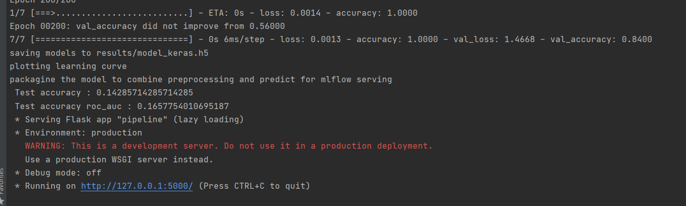
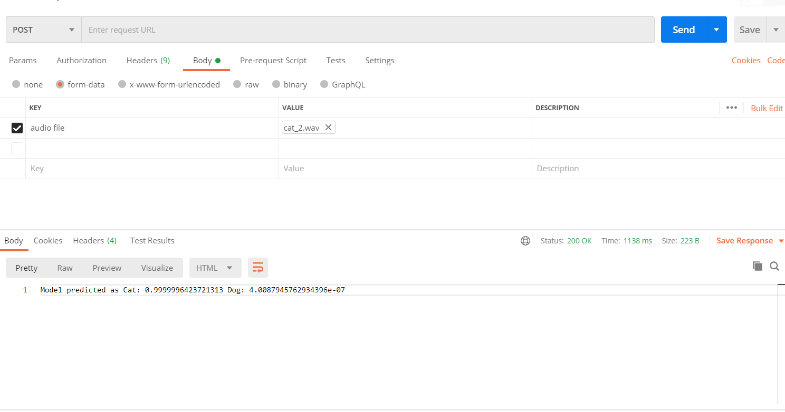

# cats_vs_dogs
Here I have tried to deploy a flask app using docker. 
I was not able to complete the MLFLow deployment process as I faced issues when packaging the trained model. Might be due to API versions.

To run the code, 
1. Please Install docker
2. run the below from inside the cats_vs_dogs directory. Make sure you see the "Dockerfile"
   *  Build docker image, this may take a while
   >docker build -t audio_classifier:latest .
   * Initialize and run container 
   >docker run -it -p 5500:8888 audio_classifier
   * After the run completes, you will see a link, which we can use as an API to make request 

3. You can either use "curl" or postman to test this, I am going to show using postman. 
    * Please open "Posetman" if you have.
    * enter "http://127.0.0.1:5000/predict?"  in "request url" tab
    * Make sure it's a "POST" request in drop down. 
    * Under "Body", select file in "Key" column and in value section choose a audio file with cat or dog.
    * Then hit "Send", the predictions are shown at the bottom as in this image 
    
### General code overview
1. "understanding_data.ipynb" is the quick exploratory analysis of the given data. 
2. pipeline.py is the driver script for the pipeline. It can be run as
> pipeline.py -T -P
3. When pipeline.py is run with "-h" parameter, it shows all the arguments it can take.
4. Model is a simple neural network without tuning. Some parts of keras tuner has been commented out as I could not complete in time. 
5. Features for the model are MFCC, although MFCC+delta contains more information it has not been explored here.
6. Tests files are empty, could not add tests in time. Sorry about that. 

### Model Deployement
1. My first initial approach was to deploy MLFLow model as it can support wide range of models unlike tensorflow serving. 
   Few other advantages are it has model tracking along with its artifact, we can track models during training, tuning and inferencing, 
   which can be used as a constant feedback. Less downtime when switching model. Easier to maintain. 
2. Since I was not able to save the model after packaging, I implemented a simpler flask deployment.

### Future Improvements
For my future self.
1. Cleaner code, use logging and reporting instead of just print, some functions contains multiple functionality - has to be split. Config files for paths. 
2. Change library version and see if the MLFlow error gets fixed. The issue is still open here https://github.com/tensorflow/tensorflow/issues/34697
3. Can try with non keras model to get the MLFlow implementation working.
4. Take care of continuous deployment. 
